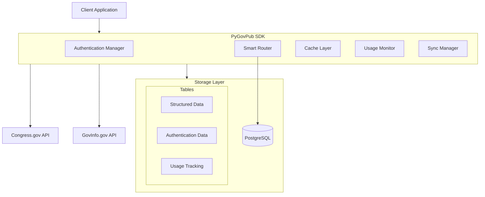
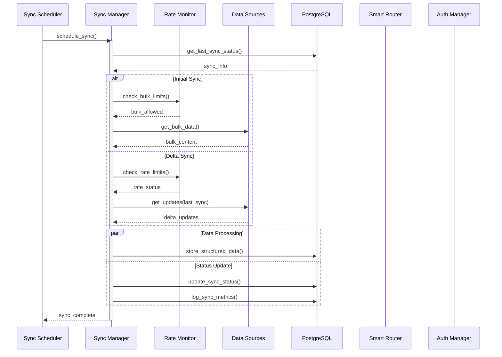
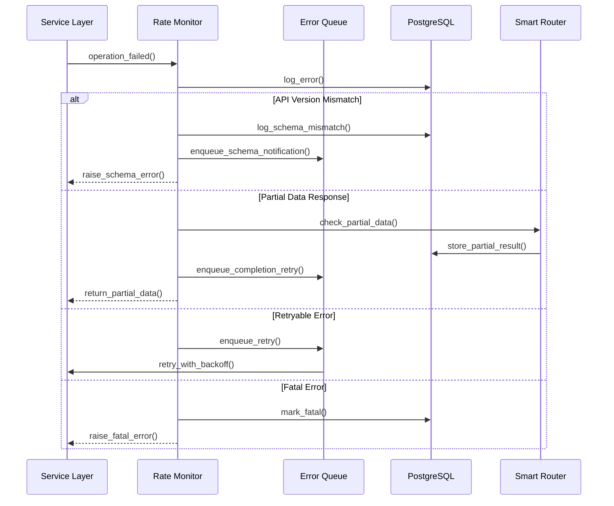
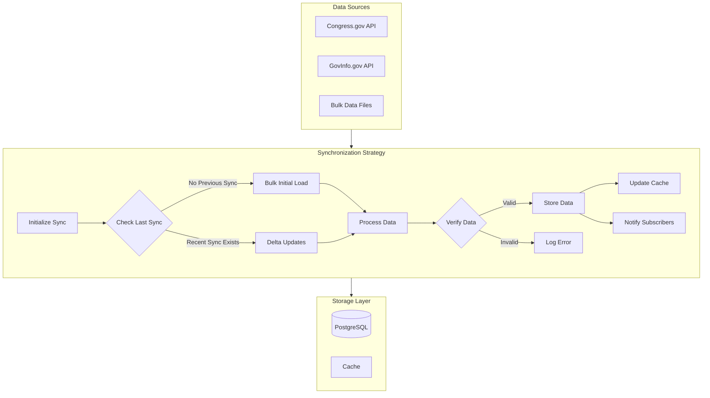
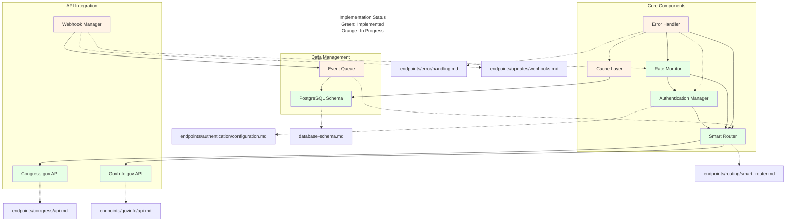

# PyGovPub SDK

## Table of Contents
1. [Overview](#overview)
2. [Technical Reference Map](#technical-reference-map)
3. [Key Features & API Boundaries](#key-features--api-boundaries)
4. [Installation & Quick Start](#installation--quick-start)
5. [Architecture & Data Flows](#architecture--data-flows)
6. [Component Scope](#component-scope)
7. [System Flows](#system-flows)
   - [Data Flow Implementations](#data-flow-implementations)
   - [Critical Sub-flows](#critical-sub-flows)
   - [Synchronization Flows](#synchronization-flows)
8. [Implementation Details & Routes](#implementation-details--routes)
9. [Testing & Quality Assurance](#testing--quality-assurance)
10. [External Documentation & References](#external-documentation--references)
11. [Accessibility Compliance](#accessibility-compliance)
12. [Development Status](#development-status)
13. [License](#license)

## Overview

PyGovPub is a Python SDK that provides unified access to U.S. Federal Government data by seamlessly integrating the Congress.gov and GovInfo.gov APIs. The SDK intelligently routes requests, handles authentication, manages rate limits, and ensures document authenticity while providing a simple, consistent interface for developers.

## Technical Reference Map

<refs>
core=README.md
func=functional-overview.md
api=fastapi-router-structure.md
db=database-schema.md
log=qa/logging-strategy.md
acc=resources/accessibility-integration.md
env=resources/.env-example
glossary=resources/glossary-integration.md
checklist=planning/checklist-guide.md
</refs>

<deps>
fastapi>=0.110
sqlmodel>=0.0.16
pydantic>=2.0
pg>=16[prod]
sqlite>=3.45[dev]
pytest>=7.4
black>=23
mypy>=1.0
pyright>=1.1.300
bandit>=1.7.5
alembic>=1.13
sqlalchemy-utils>=0.40
</deps>

## Key Features & API Boundaries

- **Smart API Integration**: Automatically routes requests to the optimal source
- **Document Authentication**: Verifies digital signatures and tracks authenticity
- **Rate Limit Management**: Handles quota tracking and request optimization
- **Real-time Updates**: Webhooks and streaming for legislative changes
- **Type Safety**: Full typing support for modern Python development

<api>
congress.limit=5000/hr
congress.auth=header.X-API-Key
govinfo.limit=1000/hr[bulk_exempt]
govinfo.auth=param.api_key
base=/api/v1
</api>

## Installation & Quick Start

```bash
pip install pygovpub

# Copy the example environment file
cp resources/.env-example resources/.env

# Edit resources/.env with your API keys
nano resources/.env
```

```python
[restore quick start code example]
```

## Architecture & Data Flows



<flows>
legislative.source=congress.gov
legislative.content=govinfo.gov
legislative.sync=24hr
legislative.auth=digital_sig
regulatory.source=govinfo.gov
regulatory.types=[fr,cfr]
regulatory.bulk=true
regulatory.auth=required
updates.methods=[webhook,stream]
updates.format=json
updates.validation=hmac-sha256
</flows>

## Component Scope

### Core Components

1. **Authentication Manager**
   - API key management for both Congress.gov and GovInfo.gov
   - Rate limit tracking and enforcement
   - Request authentication
   - Digital signature verification
   - Scope: Defined in `endpoints/authentication/configuration.md`

2. **Smart Router**
   - Request routing between APIs based on data freshness
   - Content type determination
   - Response merging
   - Relationship mapping
   - Scope: Implements patterns from `functional-overview.md`

3. **Cache Layer**
   - In-memory caching for high-frequency requests
   - Database result caching
   - Cache invalidation based on update events
   - Scope: Defined in database schema and endpoint implementations

4. **Usage Monitor**
   - API request tracking
   - Rate limit monitoring
   - Error logging
   - Usage analytics
   - Scope: Implemented in `api_usage` and related tables

5. **Sync Manager**
   - Data synchronization between APIs
   - Version conflict resolution
   - Update queue management
   - Webhook processing
   - Scope: Defined in `endpoints/updates/webhooks.md`

### Data Sources

1. **Congress.gov Integration**
   - Legislative process tracking
   - Member and committee data
   - Real-time updates
   - Rate Limit: 5,000 requests/hour
   - Scope: Defined in Congress.gov API documentation

2. **GovInfo.gov Integration**
   - Document retrieval
   - Authentication services
   - Bulk data access
   - Rate Limit: 1,000 requests/hour
   - Scope: Defined in GovInfo.gov API documentation

### Storage Components

1. **PostgreSQL Layer**
   - Structured data storage
   - Relationship management
   - Authentication tracking
   - Usage monitoring
   - Scope: Defined in `database-schema.md`

2. **ChromaDB Integration**
   - Vector embeddings for search
   - Semantic similarity matching
   - Full-text search optimization
   - Scope: Defined in ChromaDB collections schema

### Feature Implementations

1. **Legislative Content**
   - Bills and amendments
   - Member information
   - Committee activities
   - Scope: Defined in `endpoints/legislative/`

2. **Document Management**
   - Content retrieval
   - Authentication verification
   - Version tracking
   - Scope: Defined in `endpoints/documents/`

3. **Real-time Updates**
   - Webhook management
   - Event processing
   - Notification delivery
   - Scope: Defined in `endpoints/updates/`

4. **Regulatory Content**
   - Federal Register integration
   - CFR management
   - Agency tracking
   - Scope: Defined in `endpoints/regulatory/`

5. **Domain Glossary**
   - Legislative term definitions
   - Term search and enrichment
   - API response integration
   - Scope: Defined in `resources/glossary-integration.md`

## System Flows

> Note: Workflow documentation has been moved to endpoint-specific locations:
> - Updates: [endpoints/updates/workflows.md](endpoints/updates/workflows.md)
> - Authentication: [endpoints/authentication/workflows.md](endpoints/authentication/workflows.md)
> - Documents: [endpoints/documents/workflows.md](endpoints/documents/workflows.md)
> - Legislative: [endpoints/legislative/workflows.md](endpoints/legislative/workflows.md)
> - Regulatory: [endpoints/regulatory/workflows.md](endpoints/regulatory/workflows.md)

### Data Flow Implementations



### Critical Sub-flows



### Synchronization Flows



## Implementation Details & Routes

<routes>
legislative=endpoints/legislative/*
regulatory=endpoints/regulatory/*
documents=endpoints/documents/*
updates=endpoints/updates/*
auth=endpoints/authentication/*
</routes>

<schema_lines>
db=database-schema.md#1-835
api=fastapi-router-structure.md#1-479
log=qa/logging-strategy.md#1-433
unit=qa/unit-test-manifest.md#1-2632
integration=qa/integration-test-manifest.md#1-2134
</schema_lines>

## Testing & Quality Assurance

<test>
unit=qa/unit-test-manifest.md
integration=qa/integration-test-manifest.md
coverage.unit=95
coverage.integration=90
coverage.api=90
coverage.db=90
coverage.error=95
</test>

<critical>
auth_flow
rate_limiting
error_handling
db_operations
api_integration
</critical>

## External Documentation & References

<ext_docs>
congress=dev-references/congress_gov-api-documentation.md
govinfo=dev-references/govInfo-api-docs-and-samples.txt
status=dev-references/govInfo-bill-status-tool.txt
status_guide=dev-references/bill-status-implementation-guide.md
uslm=dev-references/usgpo-uslm-documentation.txt
uslm_guide=dev-references/uslm-implementation-guide.md
stack=dev-references/library-tool-documentation_fastapi-postgres-pydantic-sqlmodel-pytest-py_devguide.txt
stack_guide=dev-references/library-implementation-guide.md
</ext_docs>

## Accessibility Compliance

<a11y>
standards=[Section_508,WCAG_2.1_AA]
doc=resources/accessibility-integration.md
semantic_responses=required
error_descriptions=required
alt_text=required
screen_reader=required
</a11y>

## Development Status

PyGovPub is under active development. The current implementation follows the structured development process defined in [planning/checklist-guide.md](planning/checklist-guide.md) and focuses on:

1. Core Infrastructure
   - Authentication
   - Rate limiting
   - Response normalization
   - Error handling

2. Primary APIs
   - Legislative content (bills, amendments, etc.)
   - Member information
   - Committee activities
   - Document retrieval
   - Real-time updates

3. Advanced Features
   - Document authentication
   - Update streaming
   - Bulk data handling

## License

MIT License - see [resources/LICENSE](resources/LICENSE) for details.

### Documentation Map



```bash
pip install pygovpub
```

```python
[restore quick start code example]
```
