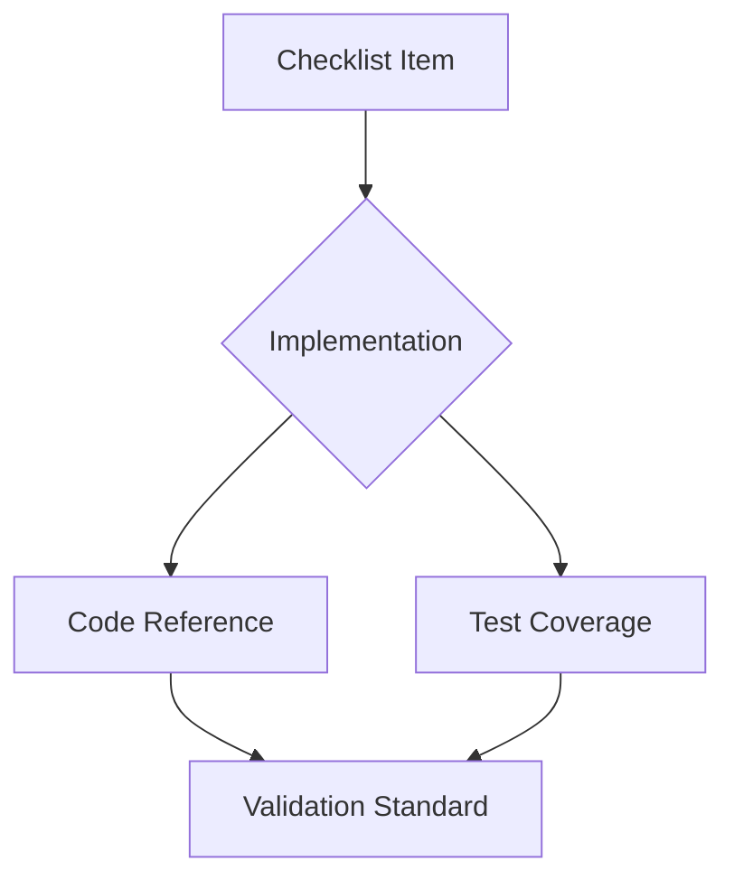

# VALID-001 Functionality Verification References

## Verification Checklist Links
1. **API Specifications**: [fastapi-router-structure.md](../../fastapi-router-structure.md#api-specifications)
2. **Test Patterns**: [unit-test-manifest.md](../qa/unit-test-manifest.md#functionality-verification)
3. **Validation Standards**: [version-compatibility.md](../standards/version-compatibility.md#api-validation)
4. **Implementation Details**: [legislative.py](../../../src/pygovpub/core/legislative.py#L23)
5. **Mock Server Documentation**: [mock_server.md](../../docs/mock_server.md#test-apis)
6. **Congress.gov API Documentation**: [Internal Implementation Guide](../../../planning/dev-references/congress_gov-api-documentation.md#endpoint-specific-documentation)
7. **GovInfo.gov Specifications**: [Technical Reference](../../../planning/dev-references/govInfo-api-docs-and-samples.txt)
8. **Bill Status Codes**: [Implementation Standard](../../../planning/dev-references/bill-status-implementation-guide.md)

## Cross-Reference Matrix
| Checklist Item | Implementation Artifact | Test Coverage |
|----------------|-------------------------|---------------|
| API Functionality | [FastAPI routes](../../fastapi-router-structure.md) | [Integration tests](../../tests/integration) |
| Data Synchronization | [Sync module](../../src/pygovpub/sync) | [Data tests](../../tests/integration/test_data_synchronization.py) |
| Real-time Updates | [Webhook service](../../src/pygovpub/webhooks) | [Event testing](../../tests/integration/test_real_time_updates.py) |
| Search Capabilities | [Vector search integration](../SEARCH-001.md) | [Search tests](../../tests/integration/test_search.py) |
| API Contract Compliance | [Congress.gov](https://api.congress.gov/docs/) • [GovInfo.gov](https://www.govinfo.gov/developers) | [Mock validation tests](../../tests/integration/test_mock_validation.py) |

## Verification Workflow
