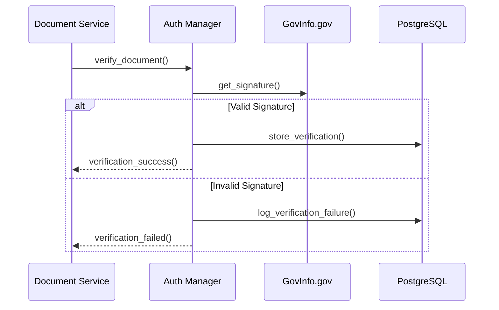
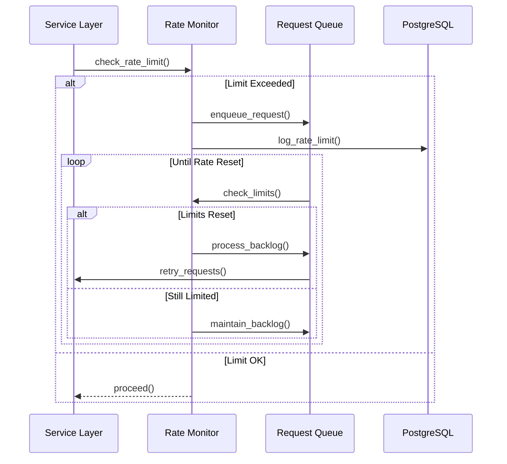
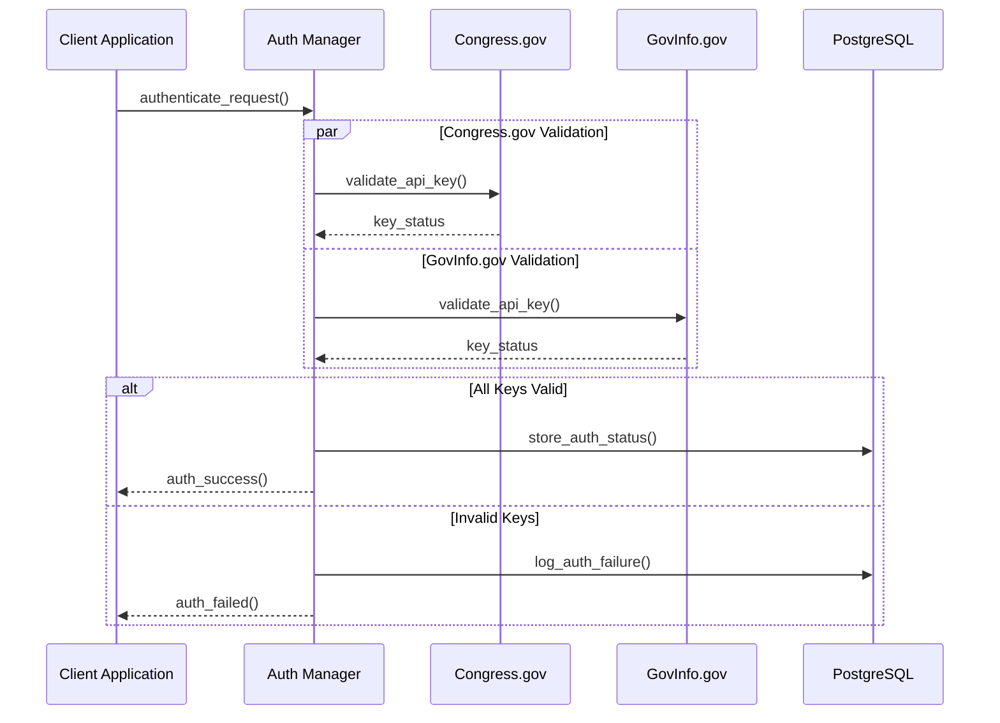

# Authentication Workflows

## Authentication Flow

```mermaid
sequenceDiagram
    participant Doc as Document Service
    participant Auth as Auth Manager
    participant GovInfo as GovInfo.gov
    participant DB as PostgreSQL

    Doc->>Auth: verify_document()
    Auth->>GovInfo: get_signature()

    alt Valid Signature
        Auth->>DB: store_verification()
        Auth-->>Doc: verification_success()
    else Invalid Signature
        Auth->>DB: log_verification_failure()
        Auth-->>Doc: verification_failed()
    end
```

## Rate Limit Management Flow

```mermaid
sequenceDiagram
    participant Service as Service Layer
    participant Monitor as Rate Monitor
    participant Queue as Request Queue
    participant DB as PostgreSQL

    Service->>Monitor: check_rate_limit()

    alt Limit Exceeded
        Monitor->>Queue: enqueue_request()
        Monitor->>DB: log_rate_limit()

        loop Until Rate Reset
            Queue->>Monitor: check_limits()
            alt Limits Reset
                Monitor->>Queue: process_backlog()
                Queue->>Service: retry_requests()
            else Still Limited
                Monitor->>Queue: maintain_backlog()
            end
        end
    else Limit OK
        Monitor-->>Service: proceed()
    end
```

## API Key Validation Flow

```mermaid
sequenceDiagram
    participant Client as Client Application
    participant Auth as Auth Manager
    participant Congress as Congress.gov
    participant GovInfo as GovInfo.gov
    participant DB as PostgreSQL

    Client->>Auth: authenticate_request()

    par Congress.gov Validation
        Auth->>Congress: validate_api_key()
        Congress-->>Auth: key_status
    and GovInfo.gov Validation
        Auth->>GovInfo: validate_api_key()
        GovInfo-->>Auth: key_status
    end

    alt All Keys Valid
        Auth->>DB: store_auth_status()
        Auth-->>Client: auth_success()
    else Invalid Keys
        Auth->>DB: log_auth_failure()
        Auth-->>Client: auth_failed()
    end
```
