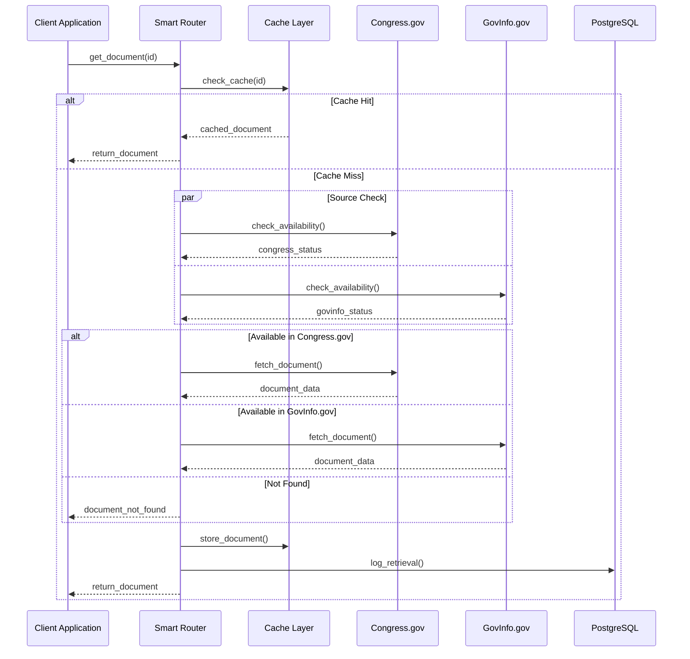
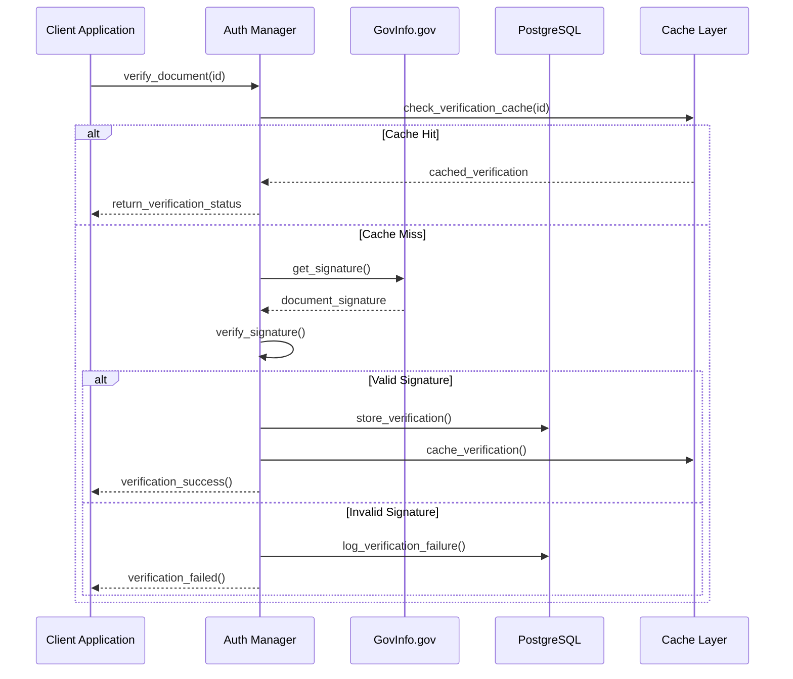
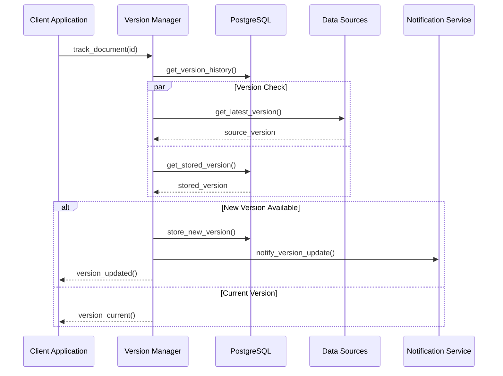
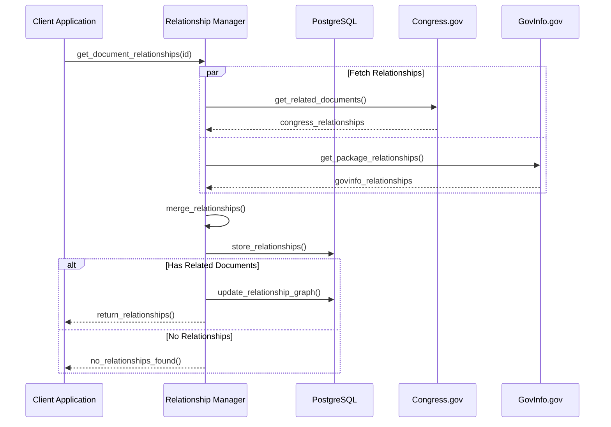
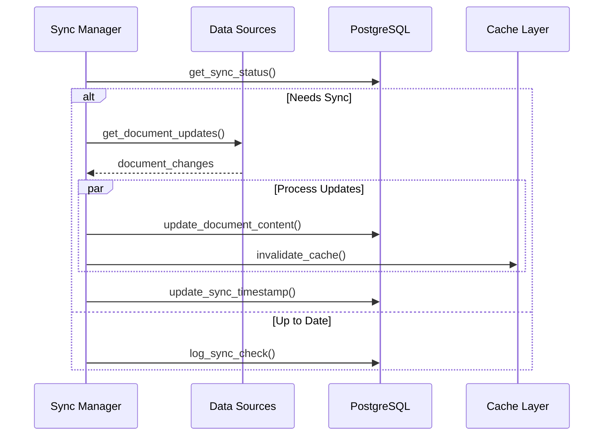

# Document Workflows

## Document Retrieval Flow

## Document Authentication Flow

## Document Version Tracking Flow

## Document Relationship Management Flow

## Document Content Synchronization Flow

