# Legislative Workflows

## Bill Management Flows

### Bill Tracking Flow

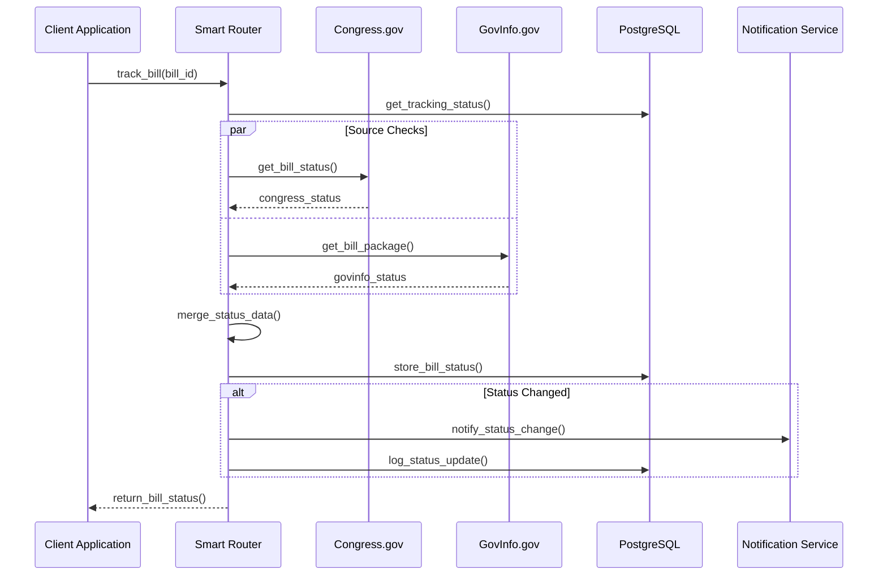

### Bill Version Management Flow

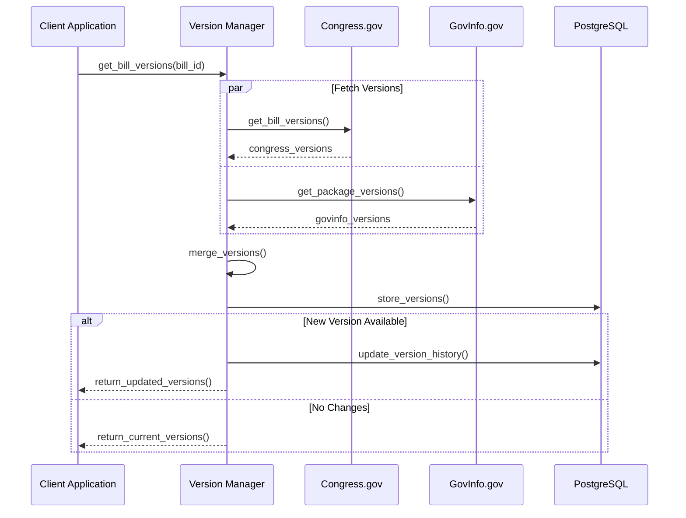

## Committee Management Flows

### Committee Activity Flow

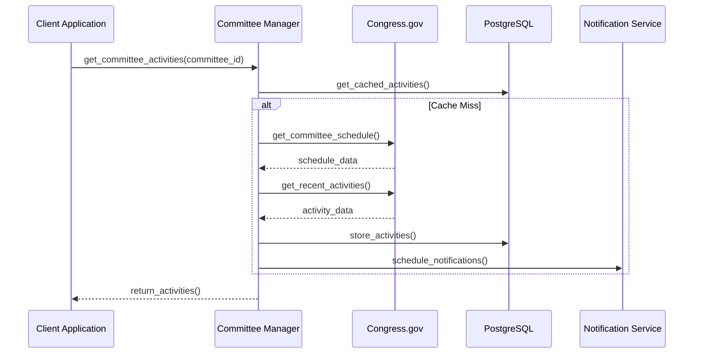

### Committee Report Processing Flow

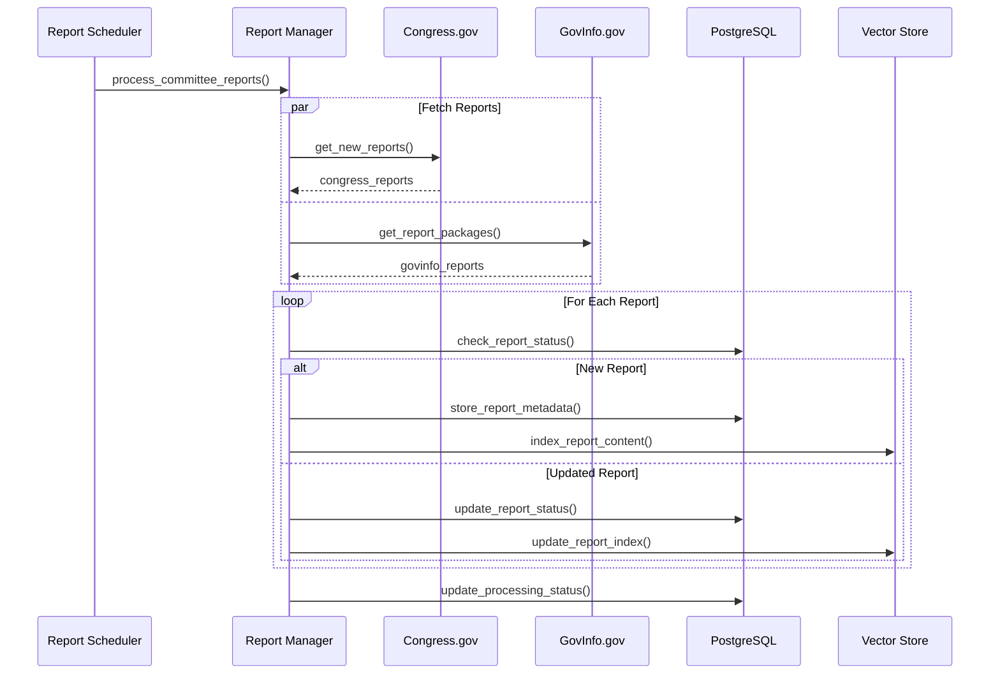

## Member Management Flows

### Member Activity Tracking Flow

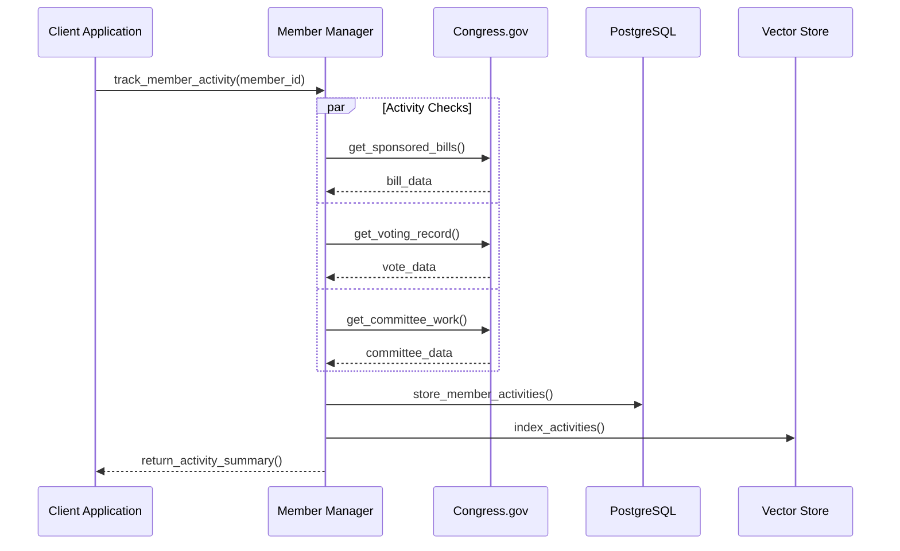

### Member Voting Record Flow

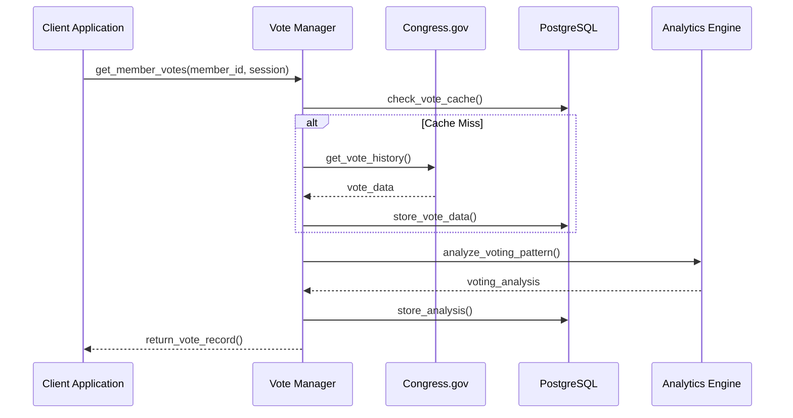

## Legislative Process Flows

### Bill Introduction Flow

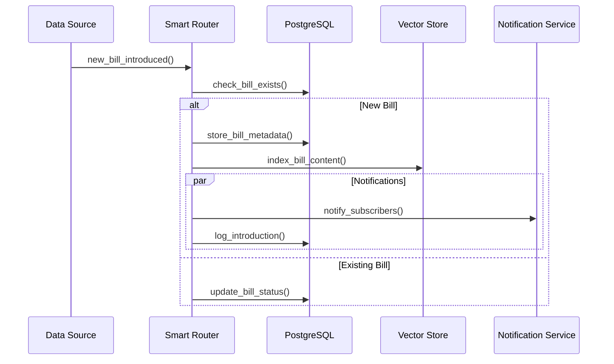

### Amendment Processing Flow

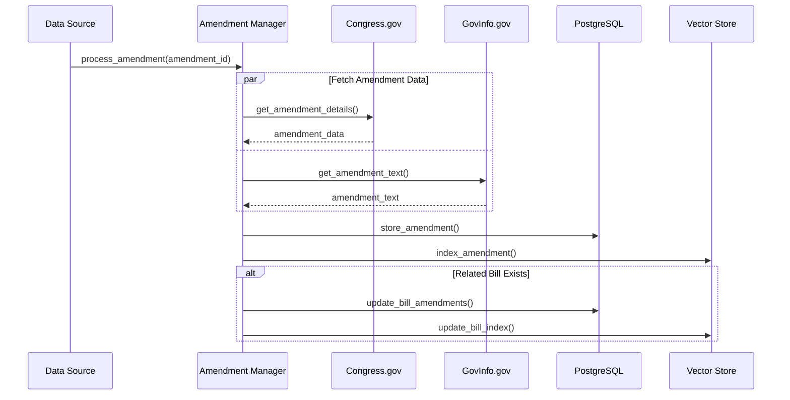

### Floor Action Tracking Flow

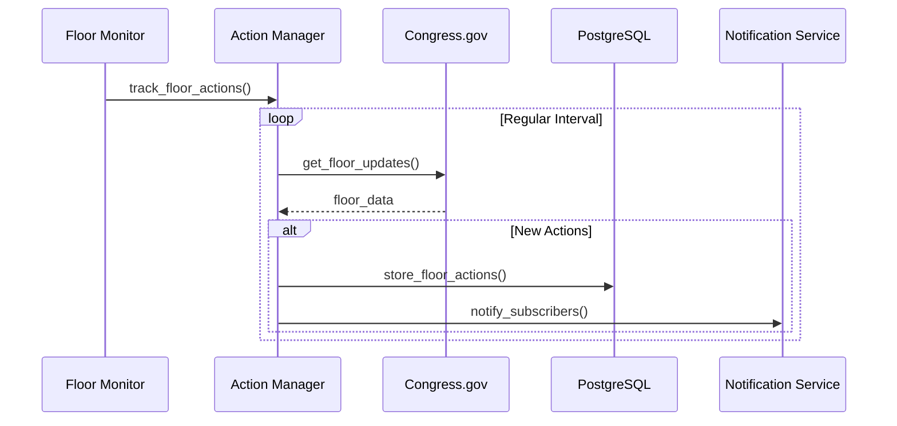

### Voting Record Processing Flow

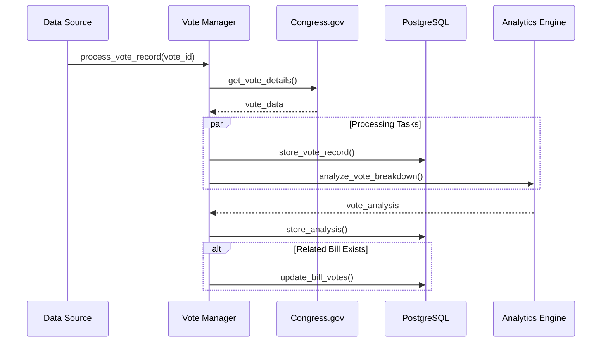

## Legislative Reference Flows

### Cross-Reference Resolution Flow

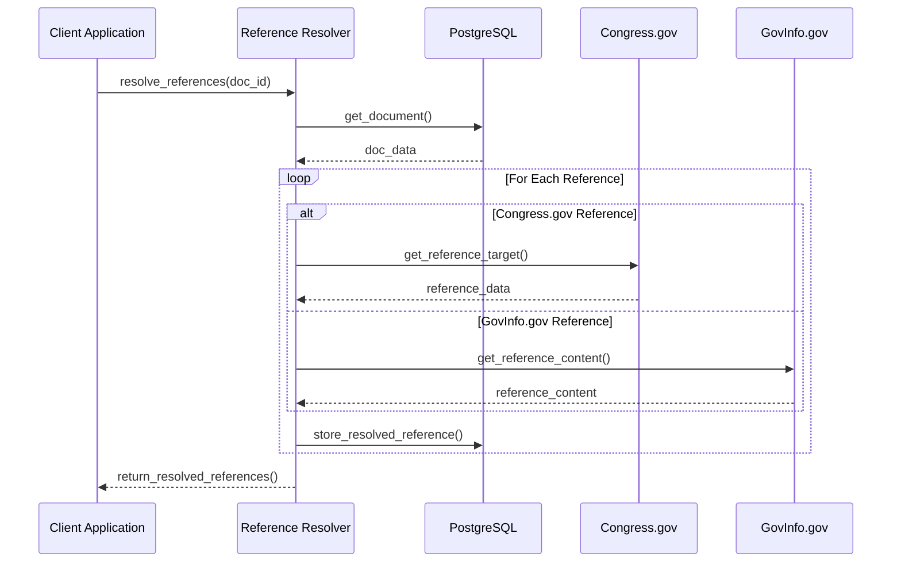

### Legislative Hierarchy Flow

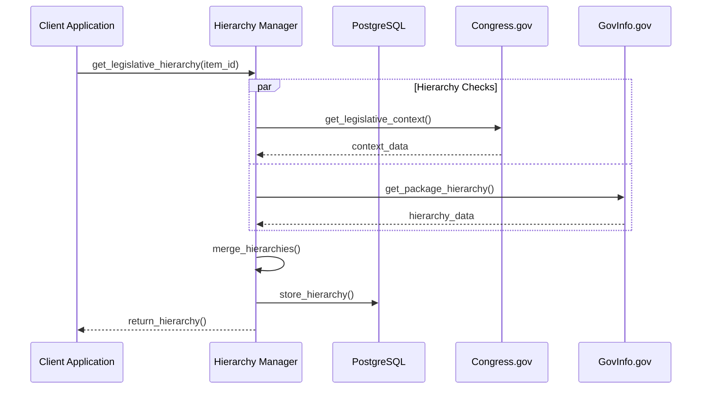
