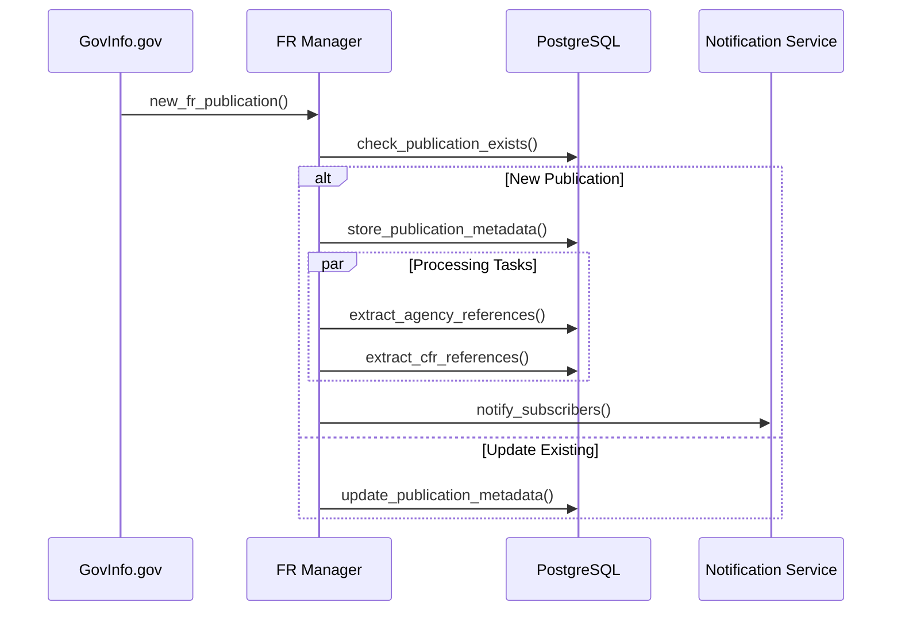
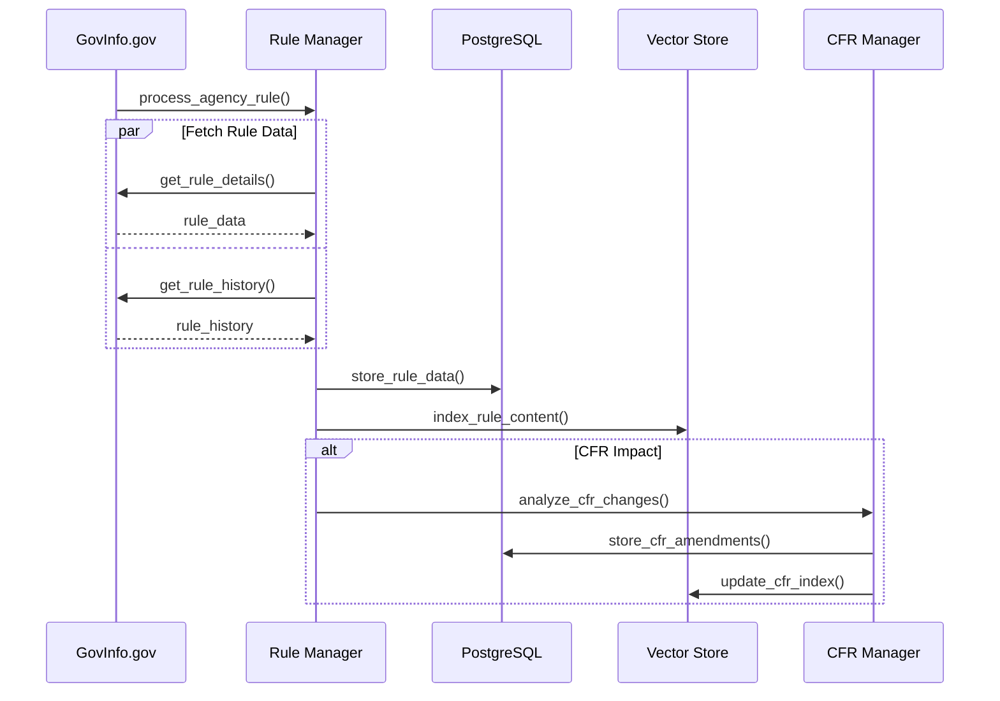
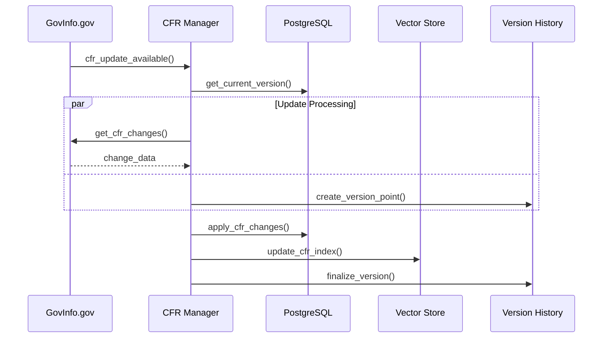
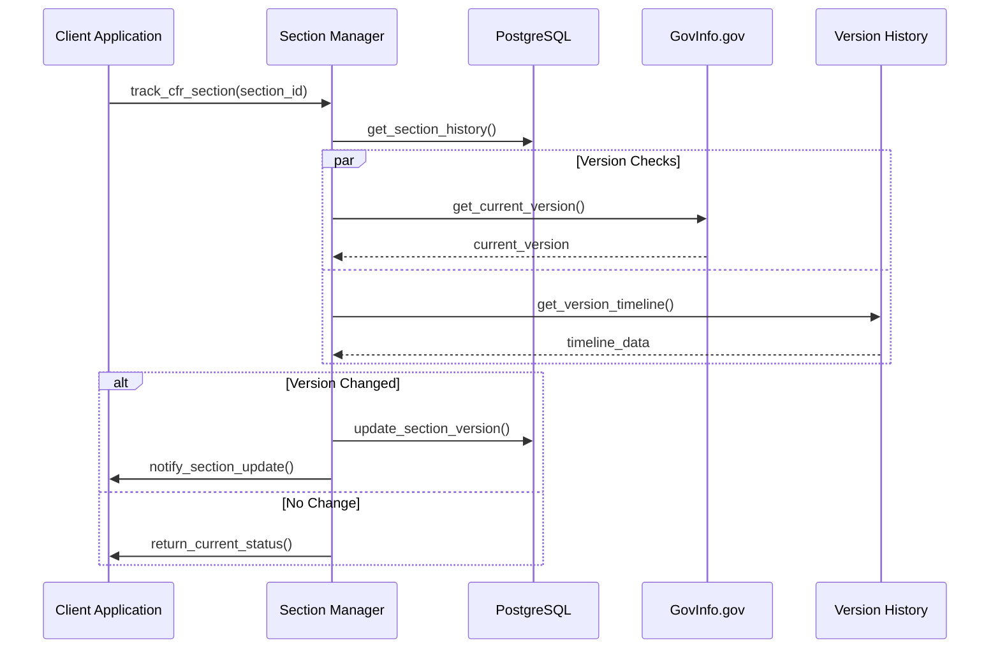
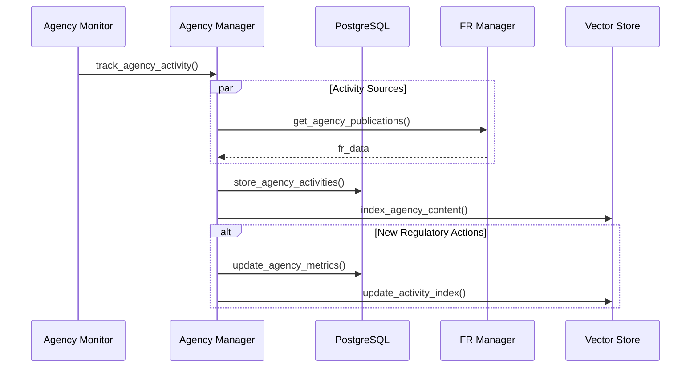
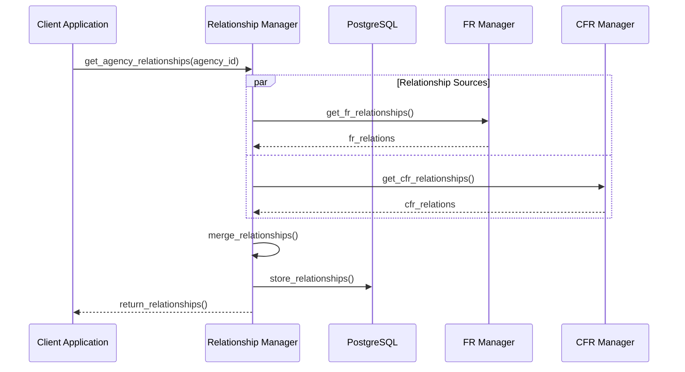
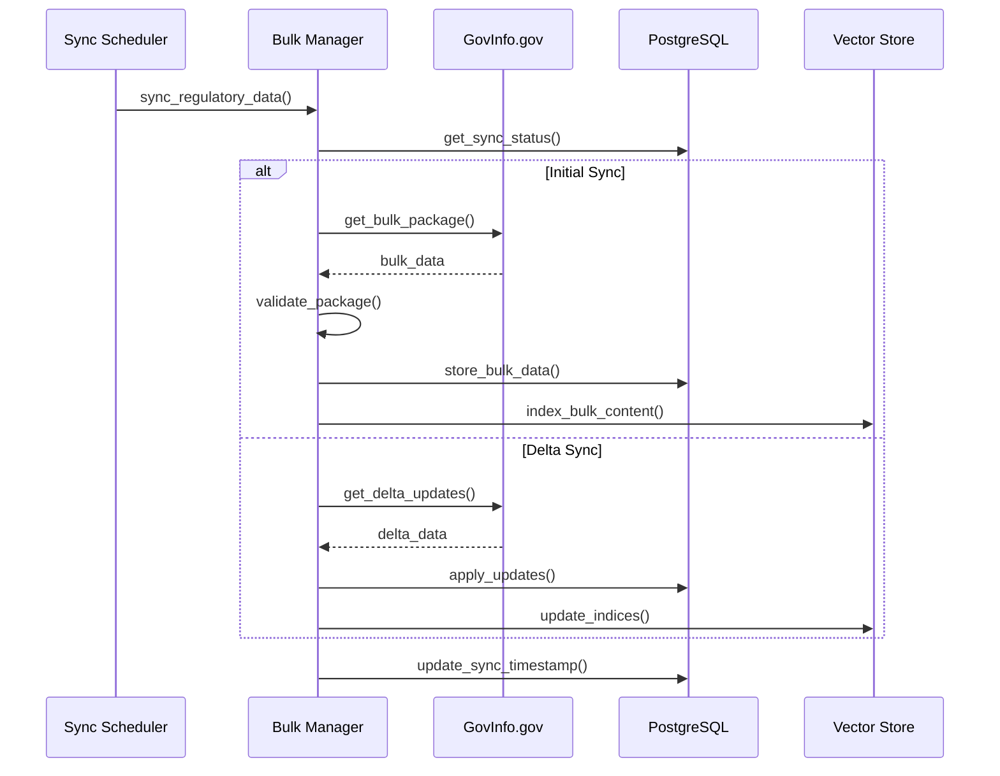
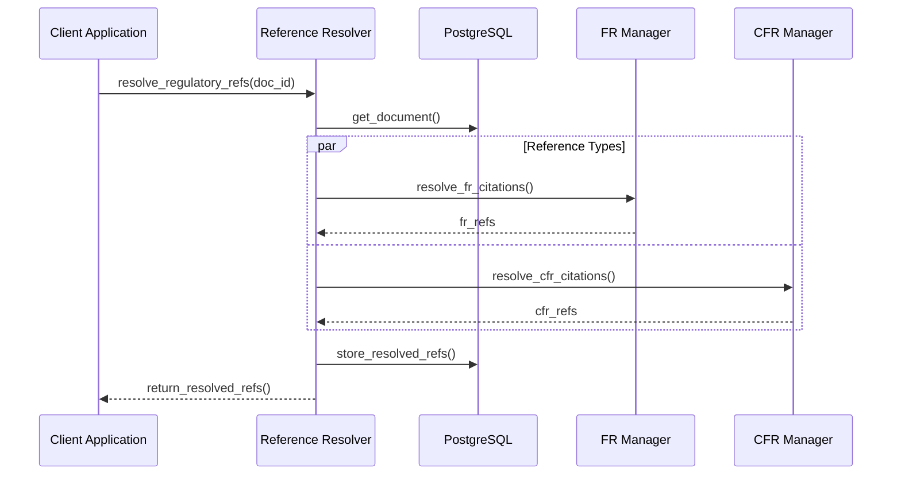

# Regulatory Workflows

## Federal Register Management

### Federal Register Publication Flow

### Federal Register Agency Rule Flow

## CFR Management

### CFR Update Flow

### CFR Section Tracking Flow

## Agency Management

### Agency Activity Tracking Flow

### Agency Relationship Flow

## Bulk Processing

### Bulk Data Synchronization Flow

### Regulatory Reference Resolution Flow

