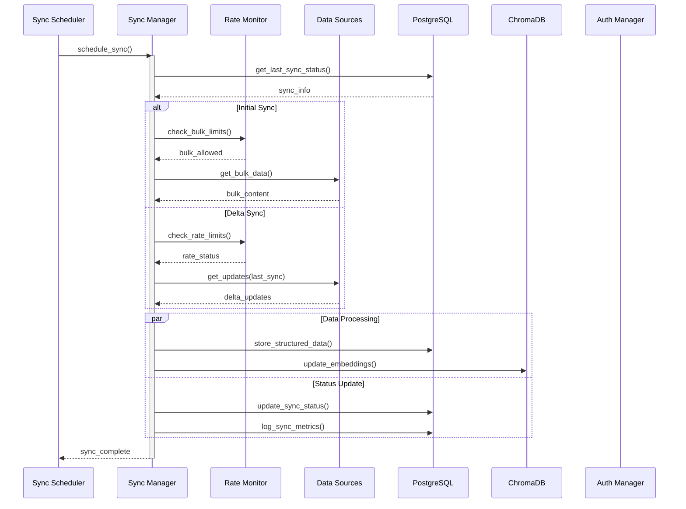
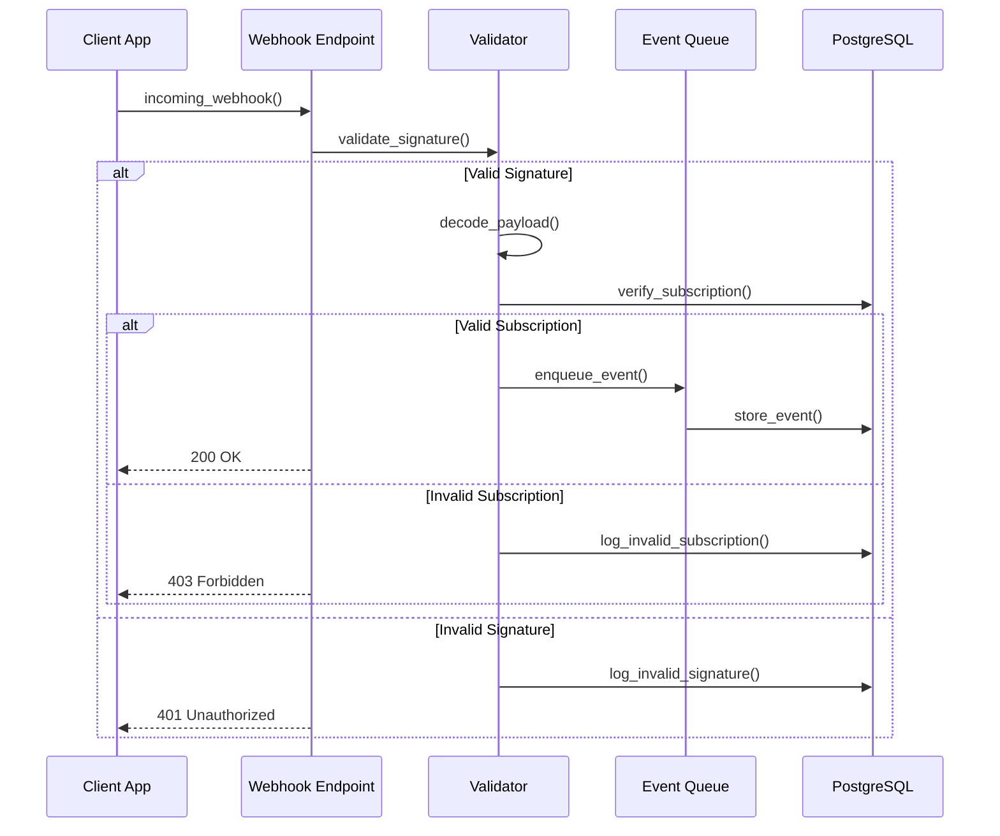
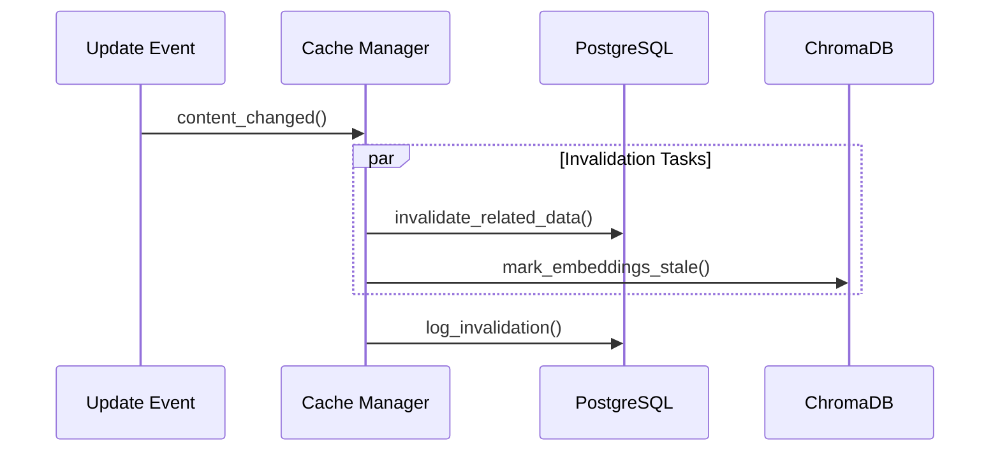
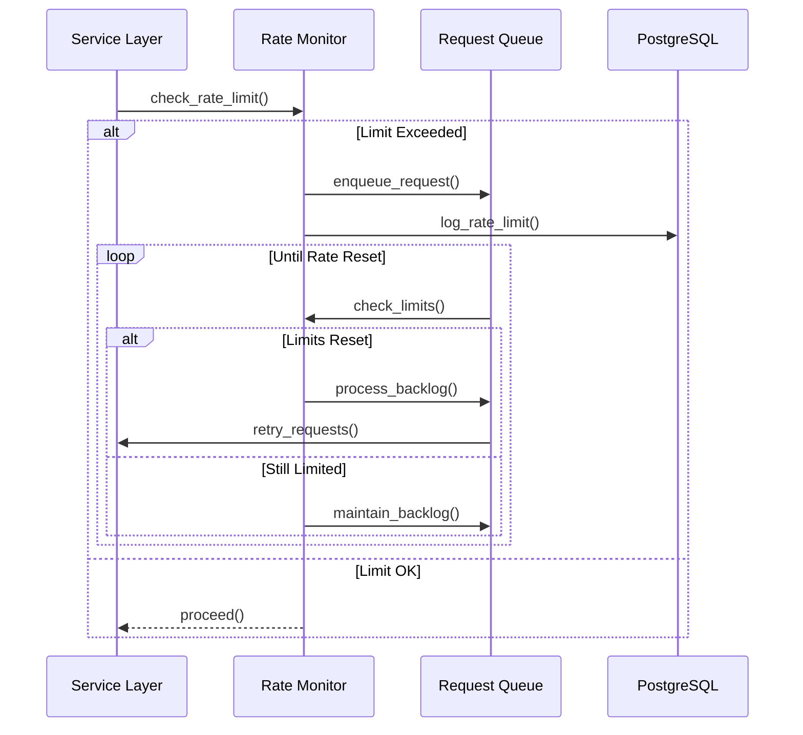
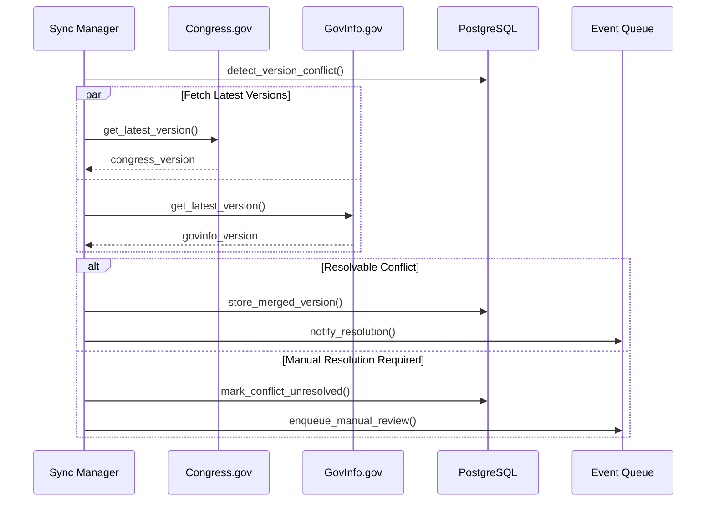
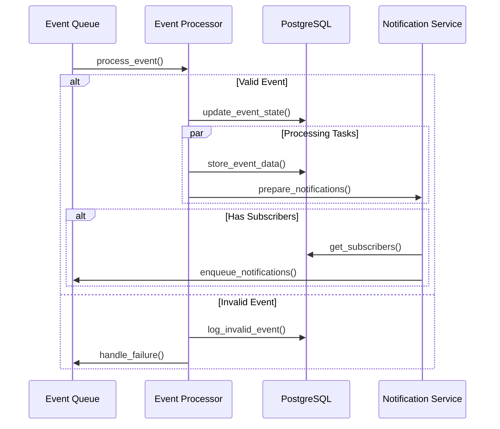
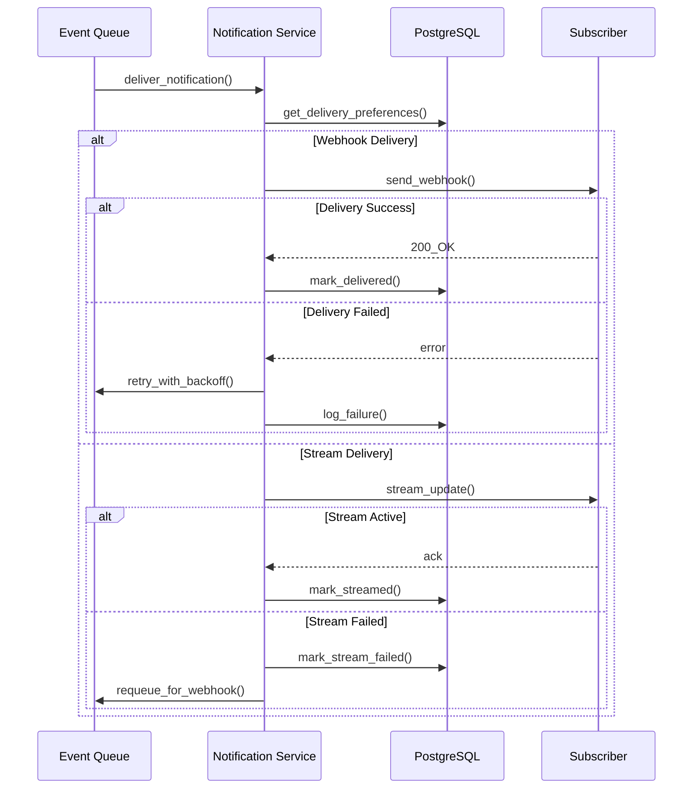

# Update Workflows

## Real-time Updates Flow

## Webhook Validation Flow

## Cache Invalidation Flow

## Rate Limit Recovery Flow

## Version Conflict Resolution Flow

## Event Processing Flow

## Notification Delivery Flow

