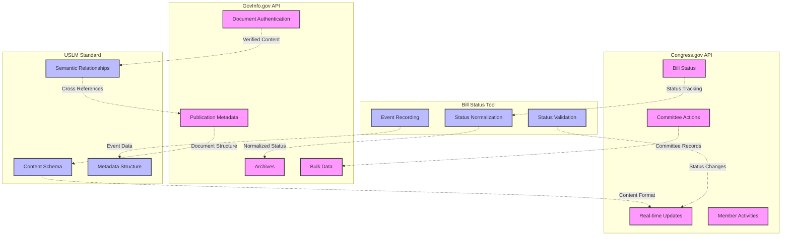

# Government Data Sources Functional Summary

## Functional Domain Overview

## Primary APIs

### Congress.gov API
**Primary Focus**: Real-time legislative process tracking

**Core Use Cases**:
- Current and historical bill status/text tracking
- Member activities and voting records
- Committee hearings and actions
- Schedule and calendar information
- Legislative process updates

**Scope Boundaries**:
- Emphasizes current status over historical archives
- Focuses on process tracking rather than document authenticity
- Provides real-time updates but not document verification
- Limited to legislative branch activities

### GovInfo.gov API
**Primary Focus**: Authenticated government document access

**Core Use Cases**:
- Official document retrieval with digital signatures
- Bulk data access for government publications
- Historical archives of authenticated content
- Publication metadata and relationships
- Cross-reference resolution between documents

**Scope Boundaries**:
- Emphasizes document authenticity over real-time status
- Focuses on official publications rather than process
- Provides comprehensive archives but with publication delay
- Covers multiple branches of government

## Supporting Standards

### Bill Status Implementation
**Primary Focus**: Standardized legislative status tracking

**Core Features**:
- Normalized representation of bill lifecycle states
- Standardized event and action recording
- Status change validation and verification
- Consistent cross-reference handling

**Integration Points**:
- Bridges Congress.gov real-time updates with formal status tracking
- Provides reference implementation for status handling
- Enables consistent status representation across systems
- Supports both API endpoints for comprehensive status management

### USLM (United States Legislative Markup)
**Primary Focus**: Standardized legislative content schema

**Core Features**:
- Next-generation XML schema for legislative/regulatory content
- Enhanced semantic relationship modeling
- Comprehensive metadata support
- Strict validation requirements

**Integration Points**:
- Future standard for all legislative content
- Enhances GovInfo.gov document authenticity
- Improves cross-reference capabilities
- Enables better machine readability and data extraction

## System Integration

### Complementary Design
The APIs and standards work together to provide a complete picture of the legislative and regulatory process:

- **Real-time Tracking**: Congress.gov API provides immediate updates
- **Document Authenticity**: GovInfo.gov ensures content verification
- **Status Standardization**: Bill Status tool normalizes status tracking
- **Content Structure**: USLM provides consistent document formatting

### Data Flow
1. Congress.gov captures real-time legislative activities
2. Bill Status tool normalizes status information
3. USLM provides structured content representation
4. GovInfo.gov ensures authenticity and preservation

### Cross-System Benefits
- Consistent status tracking across platforms
- Verified document authenticity
- Standardized content structure
- Enhanced search and discovery
- Improved data interoperability
- Reliable audit trails
