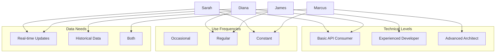

# Personas

## Overview
This document defines the key personas who interact with the PyGovPub SDK. Each persona represents a typical user archetype with specific needs, technical capabilities, and usage patterns.

## Technical Capability Levels
- **T1**: Basic API consumer, prefers simple interfaces
- **T2**: Experienced developer, comfortable with complex integrations
- **T3**: Advanced system architect, builds sophisticated solutions

## Primary Personas

### Policy Professional (Sarah Chen)
**Role**: Senior Policy Analyst at advocacy organization
**Technical Level**: T1
**Primary Goals**:
- Track specific legislation through Congress
- Monitor committee activities
- Generate reports on legislative developments
**Key Requirements**:
- Real-time updates
- Reliable data accuracy
- Easy-to-use interfaces
- Export capabilities

### Legal Tech Developer (Marcus Rodriguez)
**Role**: Lead Developer at legal software company
**Technical Level**: T3
**Primary Goals**:
- Build automated compliance systems
- Integrate legislative data into existing platforms
- Ensure document authenticity
**Key Requirements**:
- Comprehensive API access
- Robust error handling
- High performance
- Reliable authentication

### Government Relations Manager (Diana Washington)
**Role**: Corporate Government Relations Director
**Technical Level**: T1
**Primary Goals**:
- Track legislation affecting company
- Monitor key committee members
- Generate stakeholder reports
**Key Requirements**:
- Real-time alerts
- Member activity tracking
- Document verification
- Custom report generation

### Legal Researcher (Dr. James Patterson)
**Role**: Law Library Research Director
**Technical Level**: T2
**Primary Goals**:
- Access authenticated documents
- Track legislative history
- Support academic research
**Key Requirements**:
- Document verification
- Historical data access
- Cross-reference capabilities
- Bulk data retrieval

### Investigative Journalist (Elena Torres)
**Role**: Data Journalist at news organization
**Technical Level**: T2
**Primary Goals**:
- Track breaking legislative developments
- Verify official documents
- Analyze voting patterns
**Key Requirements**:
- Real-time updates
- Document authentication
- Data analysis capabilities
- Historical context

### Regulatory Compliance Officer (Michael Chang)
**Role**: Financial Services Compliance Director
**Technical Level**: T1-T2
**Primary Goals**:
- Monitor regulatory changes
- Ensure compliance
- Track implementation deadlines
**Key Requirements**:
- Change notifications
- Document verification
- Impact analysis tools
- Audit trail maintenance

### Systems Architect (Dr. Rachel Foster)
**Role**: Lead Architect at government data integration firm
**Technical Level**: T3
**Primary Goals**:
- Build enterprise integration systems
- Ensure data accuracy and completeness
- Manage high-volume data processing
**Key Requirements**:
- Complete API access
- Advanced integration capabilities
- Performance optimization
- Sophisticated error handling

## Secondary Personas

### Academic Researcher (Prof. Thomas Weber)
**Role**: Political Science Professor
**Technical Level**: T1-T2
**Primary Goals**:
- Analyze legislative patterns
- Study historical trends
- Support student research
**Key Requirements**:
- Bulk data access
- Historical archives
- Analysis tools
- Export capabilities

### API Support Engineer (Lisa Kumar)
**Role**: Technical Support Specialist
**Technical Level**: T2-T3
**Primary Goals**:
- Help users integrate SDK
- Troubleshoot technical issues
- Provide implementation guidance
**Key Requirements**:
- Comprehensive API knowledge
- Debugging tools
- Usage monitoring
- Documentation access

## Usage Patterns Matrix

## Future Considerations
- Additional personas as new use cases emerge
- Evolution of technical capabilities
- Changes in data access patterns
- New integration requirements
